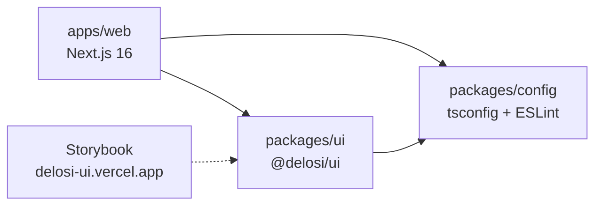
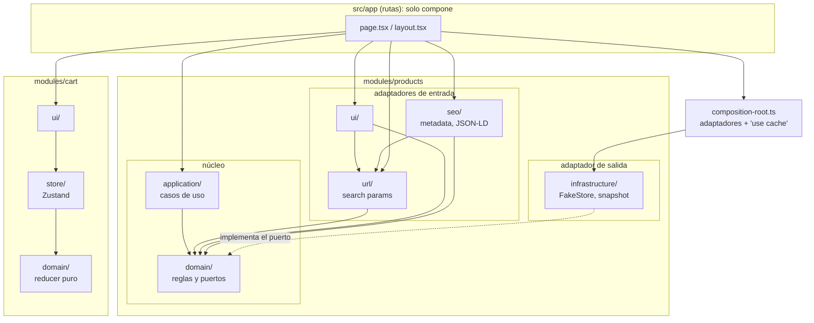
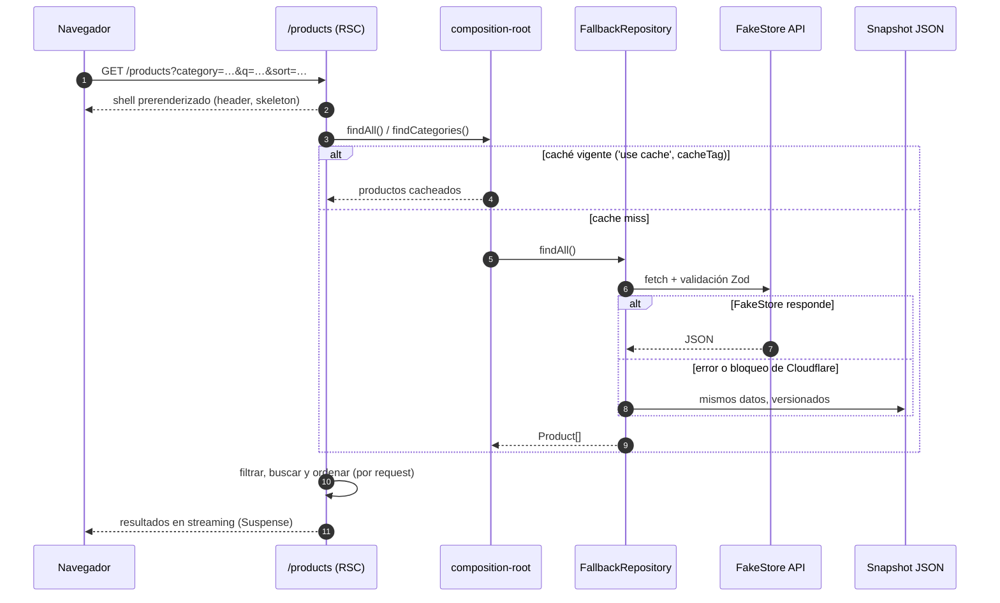
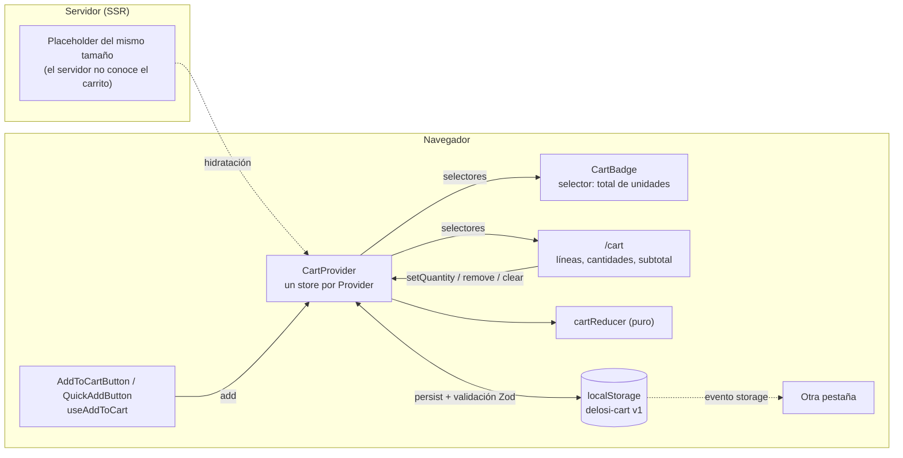
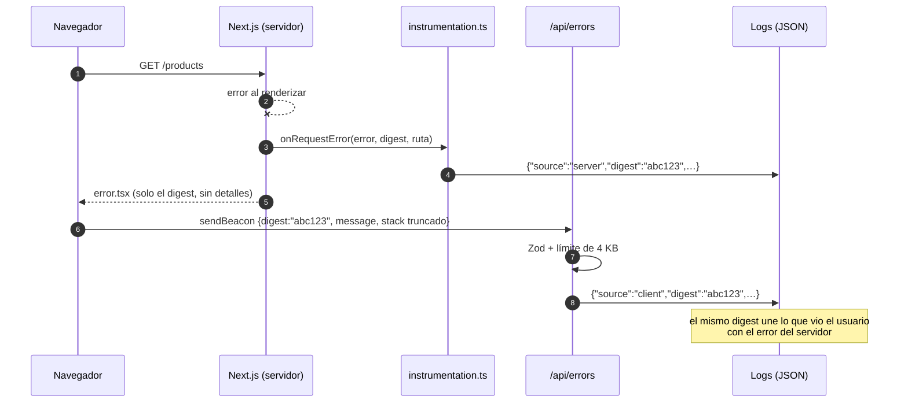

# Arquitectura

Vista general de cómo está armada la tienda. Cada decisión tiene su ADR en [`docs/adr/`](adr/); este documento las conecta.

**Diagrama interactivo:** [piercenovo.github.io/delosi-ecommerce/architecture.html](https://piercenovo.github.io/delosi-ecommerce/architecture.html), con vistas guiadas del catálogo, el carrito y la observabilidad, tema claro u oscuro y exportación. Se genera con [Archify](https://github.com/tt-a1i/archify) desde [`architecture.archify.json`](architecture.archify.json).

## 1. Monorepo

- `@delosi/ui` no tiene build: la app compila sus fuentes (`transpilePackages`). Solo contiene lo que la tienda usa ([ADR 0006](adr/0006-design-system-css-modules.md)).
- Turborepo ordena y cachea las tareas (`lint`, `typecheck`, `test`, `build`) ([ADR 0001](adr/0001-monorepo-turborepo.md)).

## 2. Módulos y capas

Cada dominio vive en `src/modules/<dominio>/` con capas hexagonales. `src/app/` solo compone: rutas, layouts y metadata ([ADR 0002](adr/0002-arquitectura-por-modulos.md)).

Las carpetas de un módulo son hermanas, pero las capas no son equivalentes: `domain/` y `application/` forman el **núcleo**; `ui/`, `url/` y `seo/` son **adaptadores de entrada** (traducen el navegador, la URL y los crawlers hacia el núcleo); `infrastructure/` es el **adaptador de salida** (implementa el puerto `ProductRepository`). Las dependencias solo apuntan hacia el núcleo.

Las reglas las hace cumplir ESLint (`import/no-restricted-paths` y `no-restricted-imports`) y las verifica [`architecture.test.ts`](../apps/web/src/test/architecture.test.ts): si alguien apaga una regla, ese test falla.

| Regla                                                                    | Por qué                                                                                |
| ------------------------------------------------------------------------ | -------------------------------------------------------------------------------------- |
| `domain/` no importa ninguna otra capa, ni React, Next o Zustand         | La lógica de negocio se testea sin framework y sobrevive a un cambio de framework      |
| `application/` solo usa `domain/` y recibe los adaptadores por parámetro | Los casos de uso se testean con un repositorio en memoria                              |
| `ui/` no usa `infrastructure/`                                           | Los componentes no saben de dónde vienen los datos                                     |
| `url/` solo usa `domain/`, sin framework                                 | La conversión URL ↔ consulta se testea sola y la comparten `ui/`, `seo/` y las páginas |
| `seo/` solo usa `domain/` y `url/`                                       | La metadata se arma con datos que la página ya tiene: no pide datos ni renderiza       |
| `store/` no usa `ui/`                                                    | El estado del cliente no depende de cómo se muestra                                    |
| `cart` no importa `products`                                             | El carrito recibe `CartProduct` por props; la página compone ambos módulos con slots   |
| Los módulos no importan `src/app` ni `composition-root.ts`               | Solo la raíz de composición conoce las implementaciones concretas                      |

**Composición por slots:** `ProductCard` y `ProductDetail` exponen `action`/`actions` y `ProductGrid` expone `renderAction`. La página inserta ahí los botones del carrito y convierte el producto con `toCartProduct`, el único punto donde los dos módulos se tocan.

## 3. Request al catálogo

- **PPR (Cache Components):** el shell estático sale al instante y los resultados llegan en streaming dentro del `<Suspense>` con `CatalogSkeleton`. Los filtros están en la URL (`searchParams`) y se leen dentro de ese límite ([ADR 0004](adr/0004-estado-en-url.md)).
- **Una sola entrada de caché para cualquier combinación de filtros:** se cachea la lista completa y el filtrado corre en cada request, que con 20 productos cuesta microsegundos ([ADR 0005](adr/0005-cache-y-revalidacion.md)).
- **Revalidación bajo demanda:** `POST /api/revalidate` con secreto invalida `products`, `categories` o `product:<id>`.
- **Resiliencia:** Cloudflare bloquea a FakeStore desde IPs de datacenter, así que `FallbackProductRepository` usa el snapshot si la API falla, y lo registra (`catalog.fallback_to_snapshot`) ([ADR 0010](adr/0010-snapshot-de-respaldo.md)).
- **Imágenes:** en producción, las fotos se cargan desde FakeStore y las optimiza `next/image` (`remotePatterns` acotado a `fakestoreapi.com/img/**`, AVIF/WebP, caché de 31 días). En CI y E2E se usa la copia local ([ADR 0012](adr/0012-imagenes-de-producto.md)). Solo las 4 primeras tarjetas cargan con prioridad; el resto es lazy.
- **Metadata:** en el catálogo va en streaming para los navegadores y completa en el `<head>` para los crawlers ([ADR 0011](adr/0011-metadata-del-catalogo.md)).

**El detalle (`/products/[id]`) no usa streaming, a propósito.** Todos los productos se prerenderizan en el build (`generateStaticParams`). Un id desconocido se renderiza bajo demanda y **bloqueando**, sin `loading.tsx` ni Suspense, para que `notFound()` corra antes de enviar el status: así se obtiene un **404 real** y los crawlers reciben el HTML completo. La página lo declara con `export const instant = false`.

## 4. Carrito

Detalle y alternativas en el [ADR 0003](adr/0003-estado-del-carrito.md):

- **Predecible:** toda la lógica está en un reducer puro con cuatro acciones, cantidades de 1 a 99 y subtotal en centavos. Si nada cambia, devuelve el mismo objeto, así Zustand no notifica a nadie.
- **Eficiente:** cada componente se suscribe a un selector; el contador del Header solo se re-renderiza cuando cambia el total.
- **Seguro en SSR:** un store por Provider (no un singleton de módulo, que se compartiría entre requests), `skipHydration` + `rehydrate()` después del primer render, y un placeholder del mismo tamaño: sin diferencias de hidratación ni CLS.
- **Robusto:** el storage propio nunca lanza (modo privado, cuota o JSON corrupto) y lo guardado se valida con Zod antes de usarse.

## 5. Errores y observabilidad

- **Puertos, no proveedores:** `ErrorReporter` y `MetricsReporter` con un adaptador de consola que escribe JSON por línea. Cambiar a Sentry o Datadog es escribir otro adaptador ([ADR 0008](adr/0008-observabilidad-sin-proveedor.md)).
- **Web Vitals reales:** `WebVitalsReporter` envía CLS, FCP, INP, LCP y TTFB a `/api/vitals` (validado con Zod, límite de 2 KB).
- **Límites de error por segmento:** `error.tsx` con "Intentar de nuevo" (`retry()` vuelve a pedir los datos), `global-error.tsx` y un 404 propio.

## 6. Calidad

La estrategia de tests está en [`testing-strategy.md`](testing-strategy.md) ([ADR 0007](adr/0007-estrategia-de-testing.md)). En CI corren en paralelo: lint, formato y tipos; tests unitarios y de integración con cobertura; build; E2E en Chromium, mobile y WebKit; y presupuestos de Lighthouse.
