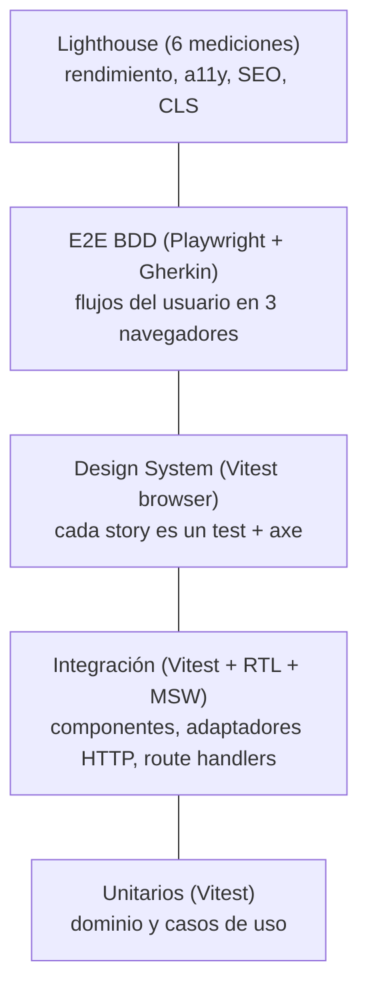

# Estrategia de testing

El criterio es **riesgo de negocio**: cada comportamiento se prueba en el nivel más barato que da confianza real sobre él. La decisión y sus alternativas están en el [ADR 0007](adr/0007-estrategia-de-testing.md).



## Qué cubre cada nivel

| Nivel         | Herramientas                                   | Qué prueba                                                                                                                                                            | Dónde                                        |
| ------------- | ---------------------------------------------- | --------------------------------------------------------------------------------------------------------------------------------------------------------------------- | -------------------------------------------- |
| Unitario      | Vitest                                         | Filtros, búsqueda, orden, reducer del carrito, selectores, parseo de ids y search params, metadata y JSON-LD                                                          | `src/modules/*/domain`, `application`, `seo` |
| Integración   | Vitest, Testing Library, MSW, jsdom            | Componentes por rol y nombre accesible, el cliente HTTP contra FakeStore simulado (reintentos, timeouts, validación), el store con `localStorage`, los route handlers | Junto al código (`*.test.ts(x)`)             |
| Arquitectura  | ESLint programático                            | Que las reglas de capas sigan activas: si alguien las apaga, el test falla                                                                                            | `src/test/architecture.test.ts`              |
| Design System | Vitest browser mode (Chromium), Storybook, axe | Cada story renderiza, ejecuta su `play` y pasa WCAG 2.2 AA en tema claro y oscuro                                                                                     | `packages/ui/src/test/stories.test.tsx`      |
| Tipos         | `@ts-expect-error`                             | APIs que impiden errores de accesibilidad, por ejemplo un `IconButton` sin nombre accesible                                                                           | `*.types.test.tsx`                           |
| E2E           | Playwright, playwright-bdd, axe                | Flujos completos contra el build de producción: catálogo, detalle, carrito, errores, accesibilidad y crawlers                                                         | `apps/web/e2e/features/*.feature`            |
| Rendimiento   | Lighthouse 13                                  | Presupuestos por página y dispositivo (rendimiento, a11y, buenas prácticas, SEO, LCP, CLS, TBT)                                                                       | `apps/web/scripts/lighthouse.ts`             |

**Umbrales de cobertura:** 80 % global y **95 % en `domain/`**, que es donde vive la lógica de negocio. Las rutas (`src/app`) y la raíz de composición quedan fuera de la cobertura unitaria porque las cubren los E2E.

## Decisiones clave

- **TDD en dominio y casos de uso:** primero el test que falla. Los bugs de UI también empiezan por un test que los reproduce (por ejemplo, el contraste de "Quitar filtros" se reprodujo con una story antes de corregirlo).
- **Sin mocks de `fetch`:** el HTTP se simula con MSW, así se prueba el cliente real (reintentos, timeouts y validación con Zod).
- **Fakes en vez de mocks:** `inMemoryProductRepository` implementa el mismo puerto que el repositorio real, así los casos de uso se prueban sin red y sin espías frágiles.
- **Localizadores por rol y nombre accesible**, nunca por clase o test id: si un test no encuentra el botón, un lector de pantalla tampoco.
- **BDD en español:** los escenarios Gherkin están en el lenguaje del negocio (`Dado que estoy en el catálogo…`), así un producto o QA puede leerlos y validarlos. Los pasos son finos y el "cómo" vive en los Page Objects.
- **Mock propio de FakeStore para los E2E:** un servidor HTTP que sirve el snapshot versionado. Los datos son siempre los mismos, CI no depende de la red ni de Cloudflare, y hay una segunda instancia de la app con la API caída para probar los errores sin estado compartido entre tests.
- **Sin esperas fijas:** se espera por estado (`expect(...).toBeVisible()`), nunca `waitForTimeout`.

## E2E

- **Tres proyectos:** Chromium desktop, mobile (Pixel 7) y WebKit. Los escenarios `@teclado` corren solo en desktop.
- **Accesibilidad:** axe (WCAG 2.2 AA) en cada página, más escenarios de teclado (el skip link es lo primero al usar Tab y se puede agregar al carrito solo con el teclado).
- **Crawlers y SEO:** un buscador (Bingbot) recibe canonical y descripción en el `<head>`; se verifican Open Graph, JSON-LD y que un producto inexistente responda 404 real con `noindex`.

```bash
pnpm build
pnpm --filter @delosi/web e2e          # los tres navegadores
pnpm --filter @delosi/web e2e:ui       # modo interactivo
pnpm --filter @delosi/web e2e:report   # último informe HTML
```

## Lighthouse

`/products`, `/products/5` y `/cart`, en mobile y desktop, con la mediana de 3 corridas. En desktop los presupuestos son los umbrales "buenos" de Core Web Vitals (LCP ≤ 2.5 s, CLS ≤ 0.02 como margen sobre 0.1). En mobile, que simula 4G lento y una CPU 4 veces más lenta, son una guardia contra regresiones. El SEO se mide aparte con el user agent de PageSpeed Insights ([ADR 0011](adr/0011-metadata-del-catalogo.md)).

```bash
pnpm build
pnpm --filter @delosi/web lighthouse
```

## En CI

Cada PR corre en paralelo: lint, formato y tipos; tests con cobertura (el informe queda como artefacto); build; E2E en los tres navegadores (el informe se sube si fallan); y Lighthouse (tabla en el resumen del job e informes HTML). Un PR solo se mergea con todo en verde.
